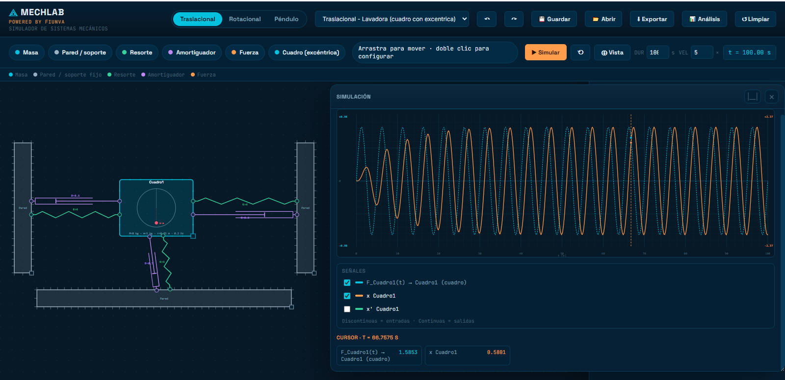
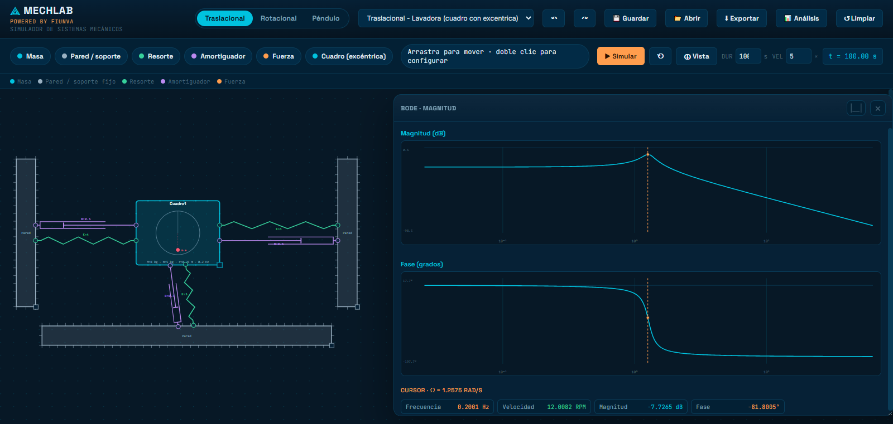
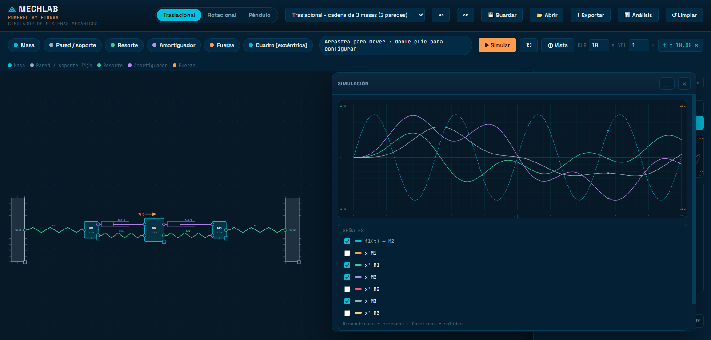
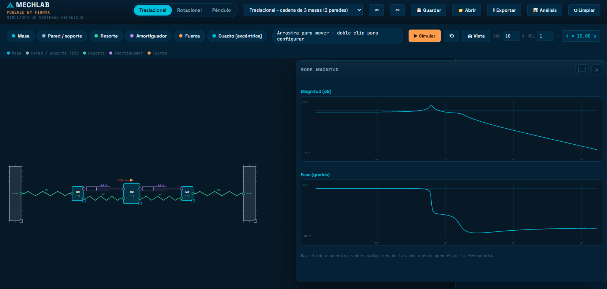
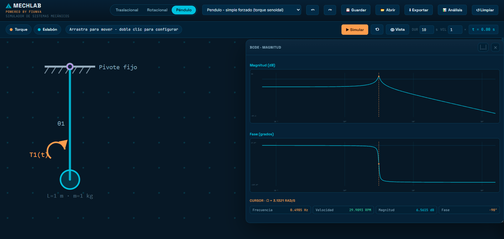
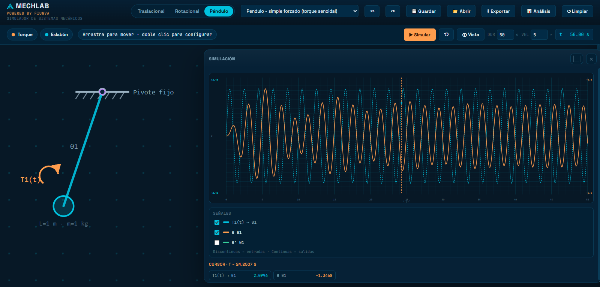

# MECHLAB

<video src="./Video/Funcionamiento.mp4" controls playsinline width="100%">
	Tu navegador no puede reproducir el video. Puedes abrirlo directamente en [Video/Funcionamiento.mp4](Video/Funcionamiento.mp4).
</video>

Link de acceso online al simulador: https://aad23110162.github.io/MECHLAB/

Simulador interactivo de sistemas mecánicos con enfoque en modelado dinámico, análisis de control y simulación temporal.

La aplicación permite construir sistemas traslacionales, rotacionales y de péndulo directamente sobre un lienzo SVG, configurar parámetros físicos y obtener de forma automática:

- Ecuaciones de movimiento
- Función de transferencia
- Representación en espacio de estados
- Polos y ceros
- Respuesta en frecuencia (Bode)
- Simulación temporal con osciloscopio de señales

## Características principales

- Editor visual tipo arrastrar y soltar para masas/inercias, paredes/soportes, resortes, amortiguadores y fuerzas/torques.
- Tres modos de trabajo:
	- Traslacional
	- Rotacional
	- Péndulo (multi-eslabón)
- Configuración por doble clic de parámetros físicos y geométricos.
- Conexión de elementos por anclajes en bordes y reconexión por arrastre de extremos.
- Simulación en tiempo real con integración numérica RK4.
- Panel de análisis con pestañas para teoría y resultados.
- Osciloscopio con selección de señales, cursor y lectura numérica.
- Presets listos para explorar escenarios típicos (cadenas de masas, lavadora excéntrica, péndulo doble/triple/cuádruple, etc.).
- Deshacer/rehacer.
- Guardar/abrir proyectos en JSON.
- Exportar diagrama a PNG.

## Tecnologías

- HTML5
- CSS3
- JavaScript (vanilla, sin framework)
- SVG para renderizado del lienzo y gráficas

No requiere backend ni proceso de build.

## Estructura del proyecto

```text
MECHLAB/
├── index.html
├── css/
│   ├── tokens.css
│   ├── topbar.css
│   ├── toolbar.css
│   ├── canvas.css
│   ├── popover.css
│   └── drawer.css
└── js/
		├── core.js
		├── model.js
		├── pendulum.js
		├── analysis.js
		├── canvas.js
		└── app.js
```

## Módulos JavaScript

- core.js
	- Utilidades matemáticas y de álgebra lineal.
	- Conversión de espacio de estados a función de transferencia.
	- Búsqueda de raíces (polos/ceros) y herramientas numéricas.

- model.js
	- Estado global del modelo físico.
	- Creación/eliminación de nodos, enlaces y fuerzas.
	- Presets, guardado/carga de proyecto y undo/redo.

- pendulum.js
	- Dinámica no lineal de péndulo multi-eslabón.
	- Linealización alrededor del equilibrio para análisis de control.

- analysis.js
	- Generación de ecuaciones, TF, matrices de estado, polos/ceros, Bode y métricas al escalón.

- canvas.js
	- Renderizado SVG de componentes y conexiones.
	- Interacciones de edición (arrastre, redimensionado, conexión, popovers).
	- Motor de simulación en tiempo real y osciloscopio.

- app.js
	- Inicialización de la app.
	- Cableado de eventos de UI (toolbar, topbar, tabs, transport).

## Cómo ejecutar

### Opción 1: abrir directamente

1. Abre index.html en el navegador.

### Opción 2: servidor local recomendado

Desde la raíz del proyecto:

```bash
python3 -m http.server 8080
```

Luego abre:

http://localhost:8080

## Flujo de uso rápido

1. Selecciona un modo: Traslacional, Rotacional o Péndulo.
2. Agrega componentes desde la paleta superior.
3. Conecta elementos (resorte/amortiguador) seleccionando dos nodos.
4. Añade una fuerza/torque sobre el elemento deseado.
5. Ajusta parámetros con doble clic en cualquier componente.
6. Abre el panel Análisis para ver ecuaciones y modelos.
7. Ejecuta Simular para observar respuesta temporal y señales.

## Ejemplos incluidos

El selector Cargar ejemplo… incluye los siguientes casos de estudio:

- Traslacional - masa simple amortiguada: sistema de un grado de libertad masa-resorte-amortiguador con entrada escalón.
- Traslacional - cadena de 2 masas: dos masas acopladas entre sí y a un soporte, útil para observar modos acoplados.
- Traslacional - cadena de 3 masas (2 paredes): tren de tres masas entre apoyos, con dinámica distribuida y múltiples resonancias.
- Traslacional - una masa central con tres ramas: topología no lineal en forma de estrella para estudiar reparto de rigidez/amortiguamiento.
- Rotacional - inercia simple con fricción: una inercia con rigidez y amortiguamiento rotacional excitada por torque.
- Rotacional - cadena de 2 inercias: dos inercias acopladas para analizar transmisión de movimiento y amortiguamiento entre ejes.
- Traslacional - Lavadora (cuadro con excéntrica): modelo vibratorio de tambor desbalanceado con fuerza centrífuga equivalente.
- Pendulo - simple (1 eslabon): péndulo de un eslabón para revisar dinámica básica angular.
- Pendulo - doble (2 eslabones): péndulo doble con acoplamiento fuerte y comportamiento más complejo.
- Pendulo - triple (3 eslabones): extensión a tres grados de libertad con interacción entre articulaciones.
- Pendulo - cuadruple (4 eslabones): caso de alta complejidad dinámica para explorar sensibilidad y oscilaciones acopladas.
- Pendulo - simple forzado (torque senoidal): péndulo simple con excitación periódica para analizar respuesta forzada.

## Galería








## Entradas y señales soportadas

- Formas de onda de entrada:
	- Escalón
	- Impulso
	- Senoidal
	- Rampa
- Salidas seleccionables:
	- Posición
	- Velocidad

## Funciones de análisis

- Ecuaciones generadas automáticamente desde la topología del sistema.
- Función de transferencia entrada/salida seleccionable.
- Espacio de estados en:
	- Variables físicas
	- Forma canónica controlable
	- Forma canónica observable
- Polos y ceros en plano complejo.
- Bode (magnitud y fase).
- Métricas de escalón (cuando aplica):
	- Valor final
	- Sobreimpulso
	- Tiempo de pico
	- Tiempo de subida
	- Tiempo de asentamiento

## Persistencia y exportación

- Guardar proyecto: genera archivo JSON con estado completo.
- Abrir proyecto: restaura modo, elementos y parámetros.
- Exportar PNG: genera imagen del diagrama del lienzo.

## Atajos e interacción

- Ctrl+Z / Ctrl+Y: deshacer / rehacer.
- Delete/Backspace: elimina componente seleccionado.
- Escape: cancela acción pendiente o cierra ventanas emergentes.
- Flechas: mueve nodo seleccionado (Shift para paso mayor).
- Rueda del ratón sobre lienzo: zoom.
- Arrastre en fondo del lienzo: paneo.

## Estado actual

Proyecto funcional como aplicación frontend estática, orientada a aprendizaje, experimentación y análisis rápido de sistemas mecánicos y de control.
